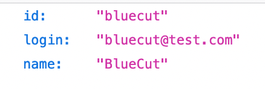

# Actix Ember

Tiny example project to set up an Ember frontend requesting an Actix server endpoint locally.

## Prerequisites

- [Git](https://git-scm.com/)
- [Node](https://nodejs.org)
- [Ember](https://cli.emberjs.com)
- [Actix](https://actix.rs/docs/)

## Install and run

Clone the repository:

```
git clone git@github.com:BlueCutOfficial/actix-ember.git
cd actix-ember
```

Split your terminal into two windows. In the first window, follow the instructions to run the backend. In the second window, follow the instructions to run the frontend.

### Run the backend:

From `actix-ember` folder:

```
cd back
cargo run
```

Visit http://127.0.0.1:8080/api/users/bluecut

👀 You should see the example endpoint (it could look different depending on your browser, but the data should be the same).



### Run the frontend:

From `actix-ember` folder:

```
cd front
npm install
ember s
```

http://localhost:4200/users/bluecut

👀 You should see the example page.


